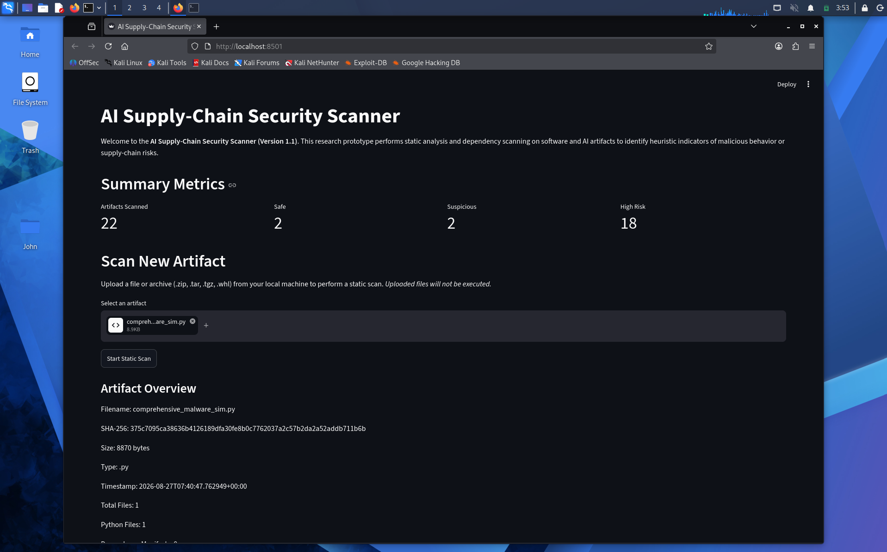
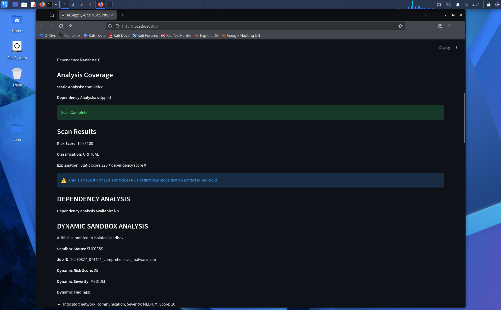
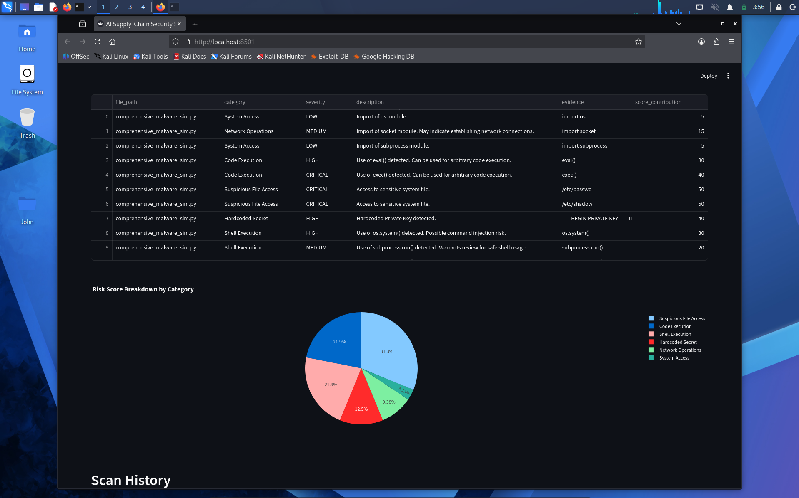
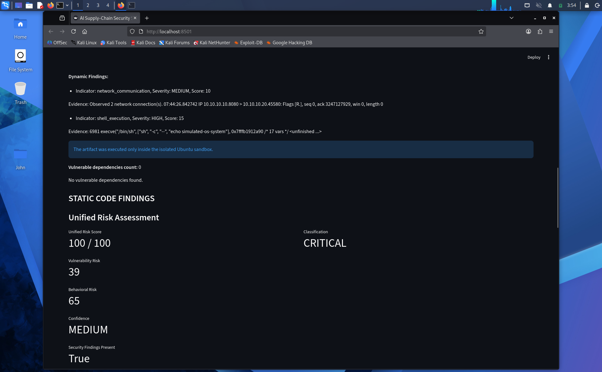
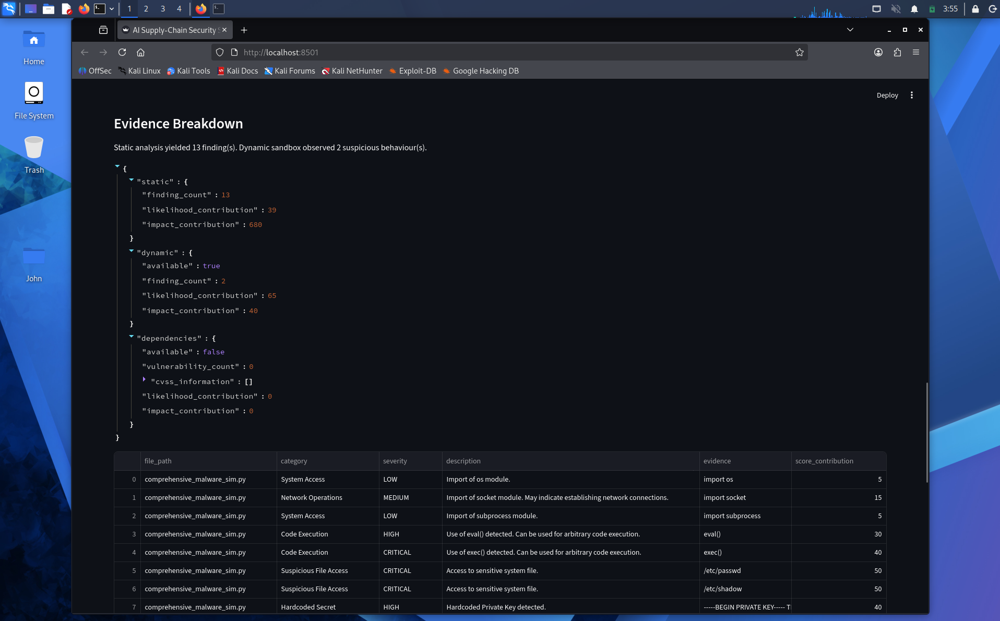
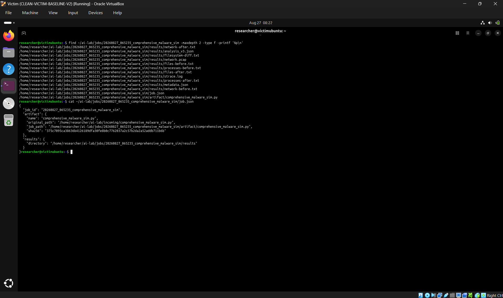
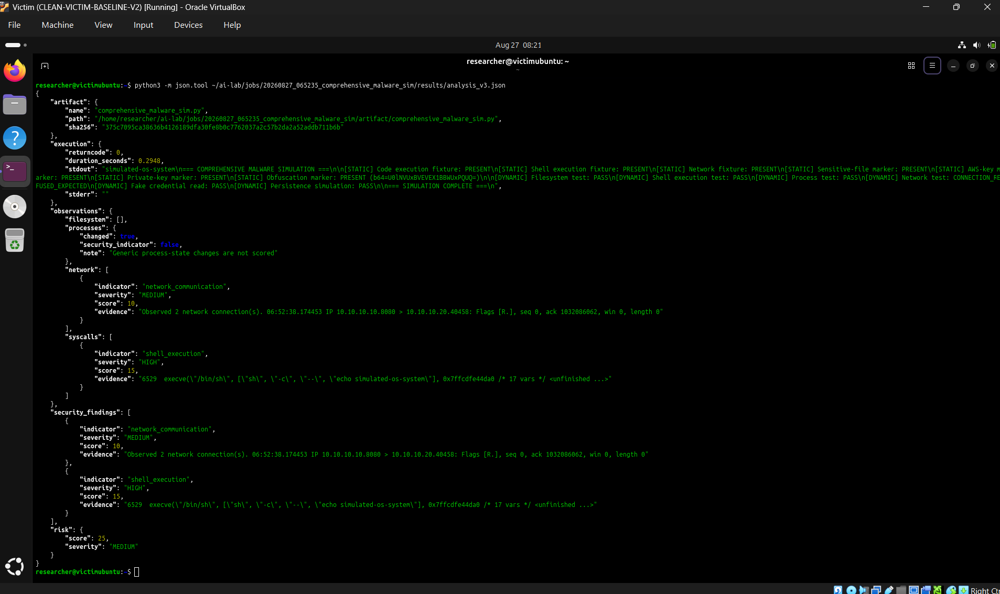

# AI Supply-Chain Security Scanner

## Project Purpose
The AI Supply-Chain Security Scanner is a research prototype designed to analyze AI and software artifacts for security vulnerabilities, malicious indicators, and supply-chain risks. It provides a foundational framework to evaluate files and codebase artifacts systematically.

## Research Motivation
With the rapid integration of AI and third-party dependencies into critical workflows, the software supply chain has become a major target for attacks. This tool aims to provide an extensible, modular platform to study and detect these threats in both traditional software and AI artifacts.

## Current Architecture
The current application (Version 1.1) is built with a modular, lightweight architecture:
- **Frontend**: Streamlit dashboard for a clean and simple UI.
- **Backend**: Python-based static analysis engine, OSV-Scanner dependency analysis integration, and rule-based risk classification.
- **Storage**: Local SQLite database for persistence of artifacts, scans, and findings.

## Version 1.1 Functionality (Phase 3)
- **Artifact Ingestion**: Upload individual files or archives (`.zip`, `.tar`, `.tar.gz`, `.tgz`, `.whl`).
- **Secure Extraction**: Archives are safely extracted to temporary directories enforcing strict limits against Zip-Slip, path traversals, and decompression bombs (max size, file count, and compression ratio limits).
- **Automated Inventory**: Generates an inventory of extracted contents (total files, size, Python files, manifests, models).
- **Multi-File Static Analysis**: Recursively analyzes all Python files (`*.py`) across the entire artifact to detect suspicious indicators (e.g., `os.system`, `eval`, hardcoded secrets).
- **Multi-Manifest Dependency Analysis**: Automatically discovers supported manifests (`requirements.txt`, `Pipfile.lock`, `pyproject.toml`, etc.) and runs `osv-scanner` across all of them, deduplicating findings.
- **Risk Aggregation**: Transparent, rule-based risk scoring system (0-100) combining vulnerabilities and suspicious code across the entire artifact.
- **Local Persistence**: Stores artifact inventories, scan histories, static findings, and dependency findings in SQLite.

## Setup Instructions
1. Ensure Python 3.9+ is installed on your system.
2. Clone this repository.

## How to Install Dependencies
Run the following command to install the required Python dependencies:
```bash
pip install -r requirements.txt
```

### Installing OSV-Scanner (Kali Linux)
Dependency analysis requires OSV-Scanner. To install it on Kali Linux:
```bash
wget https://github.com/google/osv-scanner/releases/download/v1.9.0/osv-scanner_1.9.0_linux_amd64 -O osv-scanner
chmod +x osv-scanner
sudo mv osv-scanner /usr/local/bin/
```
*(The scanner degrades gracefully if `osv-scanner` is missing.)*

## How to Run the Dashboard
Start the Streamlit dashboard by running:
```bash
python -m streamlit run app/dashboard/main.py
```

## Security Considerations & Limitations
- **Hostile Archives**: Archives are treated as hostile. Pre-extraction safety checks enforce size limits and terminate execution upon discovering path traversal attempts.
- **No Dynamic Execution**: This version relies solely on static and dependency analysis. It does not execute code to observe runtime behavior.
- **Heuristic Indicators**: Findings are based on heuristics. The presence of indicators like `os.system` does not inherently mean an artifact is malicious.
- **Dependency Limitations**: A vulnerable dependency does not guarantee malicious intent, merely that the software includes a known vulnerable component.
- **No ML Classification**: Risk scores are strictly rule-based in this version.
- **Local Only**: No cloud synchronization or central database is implemented yet.

## Planned Future Architecture
- **Version 2**: Improved static analysis and dependency analysis.
- **Version 3**: Disposable victim VM, dynamic analysis, filesystem monitoring, process monitoring, and network monitoring.
- **Version 4**: Firestore synchronization and Cloud Storage for larger evidence.
- **Version 5**: Machine-learning-assisted risk classification and larger research dataset.

## Demonstration & Validation

The following screenshots illustrate the end‑to‑end workflow of the AI Supply‑Chain Security Scanner. The pipeline runs on a Windows development machine, orchestrates analysis on a Kali Linux environment, and executes dynamic sandboxing on an isolated Ubuntu Server.

**Workflow Overview**

```
Windows → Kali Linux (analysis/orchestration) → Static + Dependency analysis → Risk scoring / sandbox threshold → Ubuntu Server (isolated sandbox) → Dynamic behavioral analysis → Unified risk assessment
```

---

### 1. Dashboard Overview


*The main Streamlit dashboard displaying overall scan results and risk scores.*

### 2. Static Analysis


*Static analysis view showing detected security findings (13 findings) for the uploaded test artifact `comprehensive_malware_sim.py`.*

### 3. Static Security Findings


*Detailed list of static security findings and their severity classifications.*

### 4. Dynamic Sandbox Analysis


*The artifact is dispatched to the isolated Ubuntu Server sandbox; this view shows the sandbox job initiation and status.*

### 5. Dynamic Security Findings


*Dynamic behavioral evidence captured during sandbox execution, including network communication and shell execution indicators.*

### 6. Kali Linux Orchestration Evidence


*Terminal output from the Kali Linux analysis/orchestration environment showing the sandbox dispatch command and job tracking.*

### 7. Ubuntu Server Sandbox Evidence


*Terminal output from the isolated Ubuntu Server sandbox displaying the dynamic analysis results and generated evidence artifacts.*

**Result Summary**

- **Static findings**: 13 security findings detected.
- **Dynamic sandbox**: Completed successfully; observed network communication and shell execution.
- **Dynamic risk score**: 25 (MEDIUM severity).
- **Unified risk score**: 100/100 → **CRITICAL** classification.
- **Confidence**: MEDIUM (based on evidence coverage).
- **Dependency analysis**: Not applicable for this controlled test artifact.

*The scanner is a research prototype that uses heuristic static analysis and behavior‑based dynamic analysis to assess supply‑chain risk. It does not claim definitive maliciousness for any artifact.*
